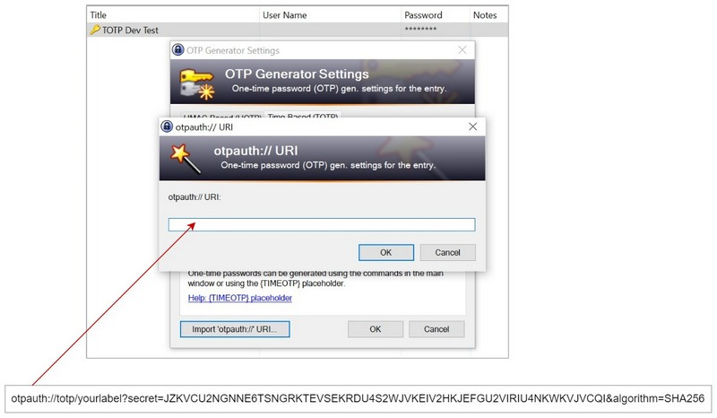

# keepass-otp

OTP Authentication with KeePass, without additional plugins

### Summary

This repository demonstrates an implementation of One-Time Password (OTP) authentication using **KeePass** for password management and **Node.js** as the backend server. The project offers a secure method for generating and verifying OTP codes that can be used to enhance user authentication. By integrating KeePass as a secure storage solution, users can easily manage their sensitive credentials, including the secret keys used for OTP generation.

The Node.js server handles OTP generation and validation using **speakeasy** library to implement Time-based One-Time Password (TOTP). The OTP secret is securely stored in **KeePass**, ensuring that only authorized users with access to the KeePass database can retrieve the secret needed to generate valid OTP codes. This setup provides an additional layer of security, combining the reliability of OTP-based authentication with the convenience of KeePass for secure credential management.

### Setup and usage

#### 1) Download and install KeePass

[KeePass Installation &raquo;](https://keepass.info/help/v1/setup.html)

#### 2) Install speakeasy npm package

```sh
npm install speakeasy
```

#### 3) Generate OTP secret by running secret.js

```sh
node ./secret.js 'yourlabel'
```
and the output will be something like:

```sh
Generated TOTP url: otpauth://totp/yourlabel?secret=JZKVCU2NGNNE6TSNGRKTEVSEKRDU4S2WJVKEIV2HKJEFGU2VIRIU4NKWKVJVCQI&algorithm=SHA256
```
enter the secret value in your local .env file e.g.:

```sh
__TOTP_SECRET=JZKVCU2NGNNE6TSNGRKTEVSEKRDU4S2WJVKEIV2HKJEFGU2VIRIU4NKWKVJVCQI
```

#### 4) Create new entry in KeePass and configure TOTP




#### 5) Get OTP code from KeePass


You can also use other applications such as [FreeOTP](https://freeotp.github.io/) for OTP code generation.

#### 6) Validate OTP code generated by KeePass with Node.js script

```sh
node --env-file=./.env ./validate.js 320446

> TOTP token to validate: 320446
> Is the token valid? true
```
## Resources

- [KeePass homepage](https://keepass.info/)
- [KeePass Installation/Portability](https://keepass.info/help/v1/setup.html)
- [KeePass FAQ](https://keepass.info/help/kb/faq.html)
- [KeePass FAQ - OTP](https://keepass.info/help/base/placeholders.html#otp)
- [Speakeasy NPM](https://www.npmjs.com/package/speakeasy)
- [Speakeasy Github repo](https://github.com/speakeasyjs/speakeasy)
- [Key URI Format](https://github.com/google/google-authenticator/wiki/Key-Uri-Format)
- [FreeOTP two-factor authentication application](https://freeotp.github.io/)
- [Implementing TOTP with nodejs](https://leoarok.medium.com/implementing-totp-with-nodejs-1e29762fdefe)
